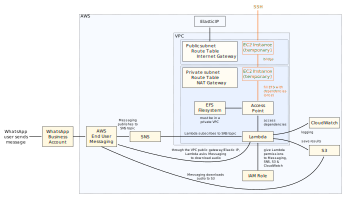
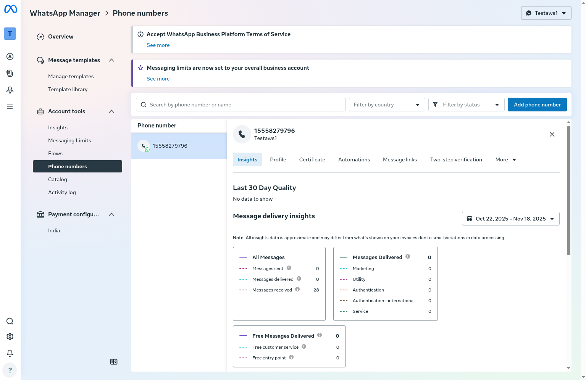
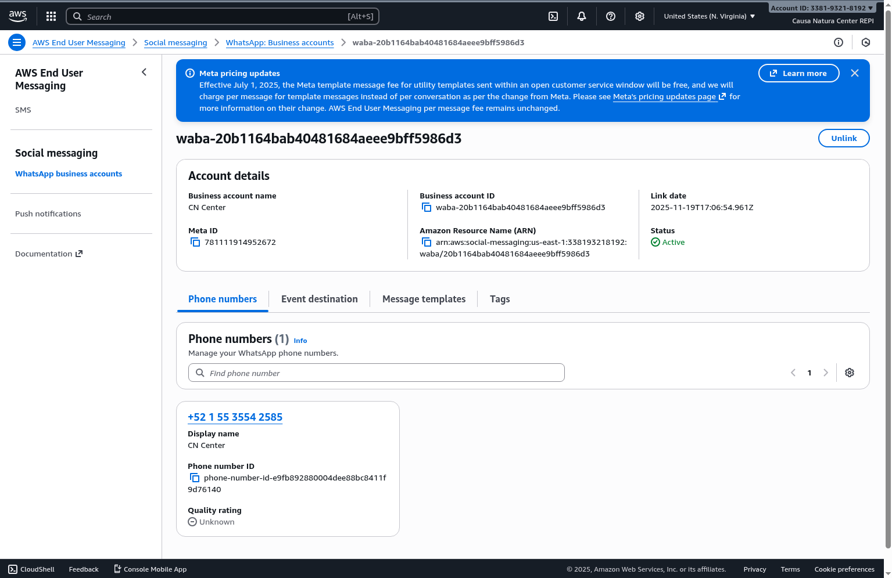
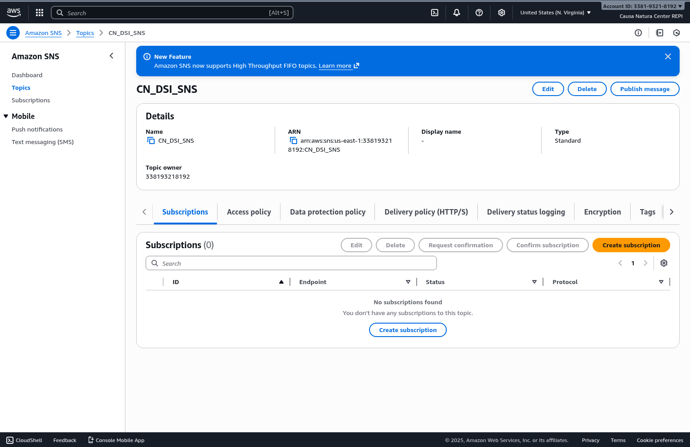
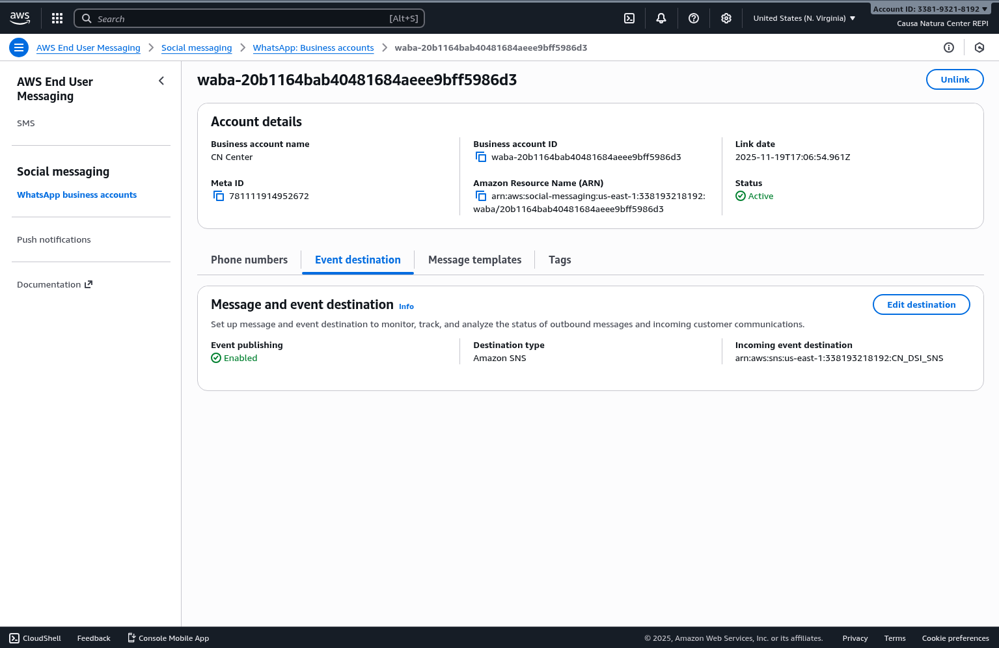
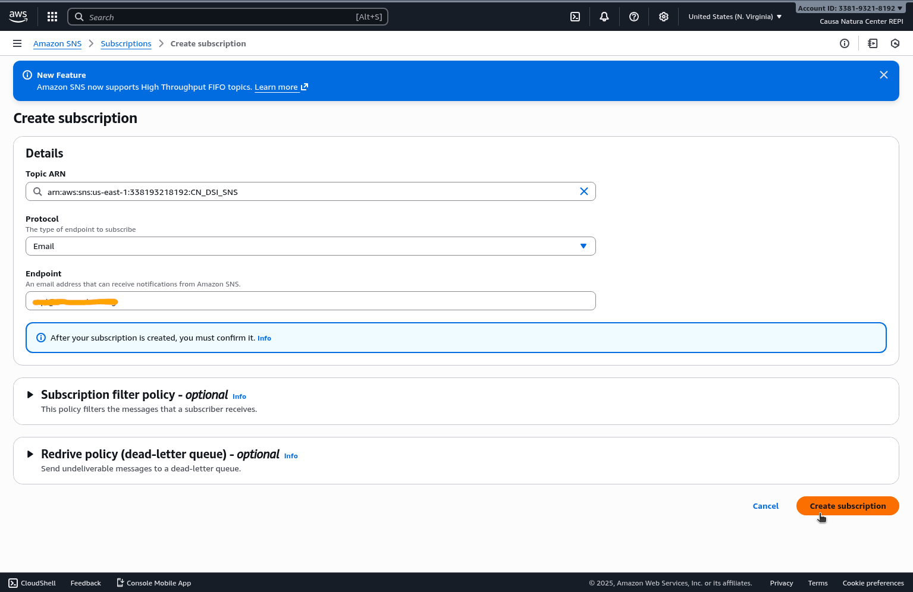

# CN-DSI

This repository contains only one source code file for the WhatsApp-to-AWS transcription workflow: [lambda_function.py](lambda_function.py), the code that the Lambda function runs. However, most of the set-up is outside of Lambda. This README describes how the whole AWS account was configured.

The diagram below is an overview of the whole workflow. Each of the steps, and how to set them up, will be described with screenshots of the AWS web GUI.

## WhatsApp Business Account

The first step is to get a WhatsApp Business Account, such as this:

It's a phone number that WhatsApp users can send messages to, and it can join a WhatsApp group to get all messages sent to that group.

## AWS Social Messaging

Next, the WhatsApp Business Account should be added to AWS End User Messaging > Social messaging > WhatsApp: Business accounts, like this:

(Note that this is a different account from the one shown in the previous section.)

## SNS (Simple Notification Service)

Messages are sent from Social Messaging to Lambda through an SNS queue: Social Messaging publishes to an SNS topic and Lambda subscribes to it. Below is an SNS topic:

Publications are set up in the Social Messaging GUI, so go back to this GUI and click on the "Event destination" tab.

An SNS topic can have more than one subscriber, and you might want to set up an email subscription for testing. To do that, click on "Create subscription," choose the "Email" protocol, and enter the email address as an endpoint.

